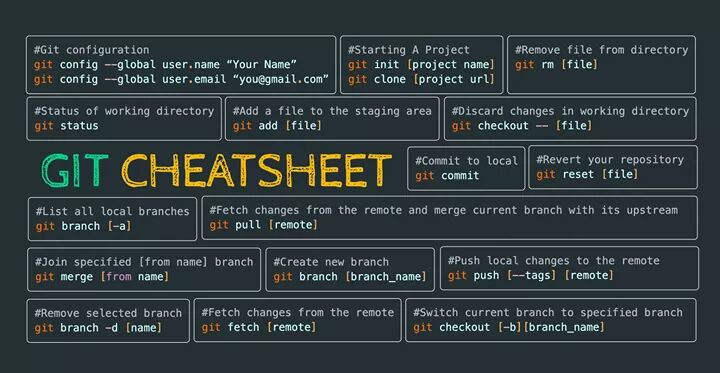

# git-problem-skills
Uses search(Ctrl+F) before using google 🔥

What is Git & the needed?
 <b>

- 
- 
- 

All kinds
 <b>

| All    | Loại                                                                                              |
| -------| :-------------------------------------------------------------------------------------------------|
| Tất cả | boolean , number , string , array , object , tuple , enum , any , void , undefined , null , never |
| Common | boolean , number , string , array , object, void , undefined , null                               |

Git structure
 <b>

folder .git

Git starter
 <b>

  config user/pass
  git init
  git clone (add remote / add default origin)

Git commands
 <b>

  clone
  add
  status
  commit
  branch
  branch -a
  checkout
  diff
  log
  push

Git problem skills
 <b>

  remove add (not include commit)
  remove add (include commit)
  merge
  conflict
  cherry-pick
  fork
  reset-hard
  reset-soft
  undo-commit
  re-base

